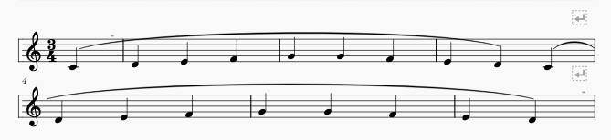
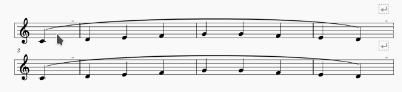

# MuseScore smart line-break plugin
MuseScore 3.0 plugin to ease the addition of line breaks in the middle of measures.

## Usage

To use this plugin, you must select a single note, then activate it. It will :
- split the measure before the selected note
- set a dashed barline between the two halves
- decrement the measure number for the second half
- add a line-break between the two halves

## Motivation

This plugin is useful when you are writing scores with musical phrases not spanning on entire measures.
It allows better alignment between lines.

Example without the plugin :

With a smart line-break, it becomes :

Notice how the total number of measures was not modified.

## License

This project is licensed under the GPL version 3. (Mostly because other MuseScore plugins I've found on github are licensed likewise).
